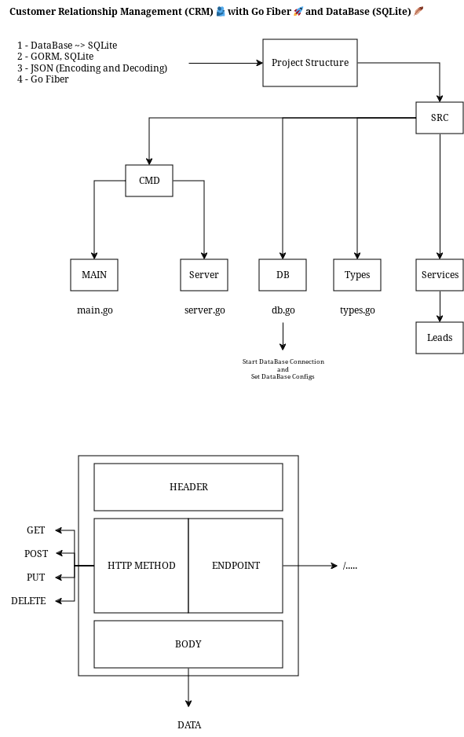

# go-fiber-crm-sql

⚠️ **NOTE!!!!!** This Goalng App Written for Me - So some Things Might not Work on Your PC or Laptop as this was Never Intended to be a Usable Full Fledged Application, in that Case, Please Try if You Can Fix that Up as Much as Possible, or you can Open an Issue for Help :) - You Need to Change Something Related to DataBase - So Please Check Everything Before Running the Database and Server.



## Requirements

- make
- [SQLite](https://www.sqlite.org/)

## Makefile

A Standard GNU Make File is Provided to Help with Running and Building Locally.

```text
help                 💬 This Help Message
lint                 🔎 Lint & Format, will not Fix but Sets Exit Code on Error
lint-fix             📜 Lint & Format, will Try to Fix Errors and Modify Code
build                🔨 Build Binary File
run                  >_ Run the Web Server Locally at PORT 9010
init                 📥 Download Dependencies From go.mod File
clean                🧹 Clean up Project
image                📦 Build Docker Container Image from Dockerfile
push                 📤 Push Container Image to Registry
```

Makefile Variables

| Makefile Variable | Default                |
| ----------------- | ---------------------- |
| SRC_DIR           | ./src/                 |
| DEFAULT_GOAL      | help                   |
| BINARY_NAME       | main                   |
| BINARY_DIR        | ./bin/                 |
| IMAGE_REPO        | soelz/go-fiber-crm-sql |
| IMAGE_TAG         | 0.1                    |

## Containers

RUN Server in a Container

```bash
docker run --name gfcq -p 9010:9010 soelz/ecom-sql-rest-api:0.1
```

<p align="center">
  <picture>
    <source srcset="https://raw.githubusercontent.com/nordtheme/assets/main/static/images/elements/separators/iceberg/footer/dark/spaced.svg" width="100%" media="(prefers-color-scheme: light), (prefers-color-scheme: no-preference)" />
    <source srcset="https://raw.githubusercontent.com/nordtheme/assets/main/static/images/elements/separators/iceberg/footer/light/spaced.svg" width="100%" media="(prefers-color-scheme: dark)" />
    
  </picture>
</p>
